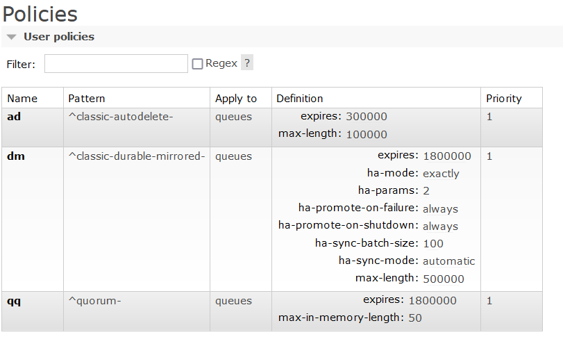

# rabbit-load-generator

Tool to generate queue and message load that mimics CareAware's 3 main queue types:

1. quorum queues
1. classic durable mirrored queues
1. classic transient auto-delete queues

The following server-side policies are in place for each queue type:



## Configuration

See the following classes for additional configuration:

1. [RabbitProperties](https://docs.spring.io/spring-boot/docs/current/api/org/springframework/boot/autoconfigure/amqp/RabbitProperties.html)
2. [RabbitLoadGeneratorProperties](src/main/java/com/cerner/test/RabbitLoadGeneratorProperties.java)

### NonProd-01

To mimic NONPROD-01 cluster, use the following configuration:

```yml
---
spring:
  profiles: 1k-qq
rabbit-load-generator:
  rabbitServiceName: rabbitmq-04
  scenarios:
  # Creates 33 connections, 330 channels, 999 quorum queues, 999 bindings, and 15984 consumers
  # For each of the 999 bindings, a message is published every 120 seconds for a total throughput of 8.3 msgs/sec
  - queueNamePrefix: quorum-
    connections: 33
    channelsPerConnection: 10
    queuesPerChannel: 3
    consumersPerQueue: 16
    bindingsPerQueue: 1
    autoDelete: false
    isDurable: true
    isQuorum: true
    publishInterval: 120000
    publishPersistent: true

---
spring:
  profiles: 1k-durable-mirrored
rabbit-load-generator:
  rabbitServiceName: rabbitmq-04
  scenarios:
  # Creates 33 connections, 330 channels, 999 durable classic queues, 999 bindings, and 7992 consumers
  # For each of the 999 bindings, a message is published every 120 seconds for a total throughput of 8.3 msgs/sec
  - queueNamePrefix: classic-durable-mirrored-
    connections: 33
    channelsPerConnection: 10
    queuesPerChannel: 3
    consumersPerQueue: 8
    bindingsPerQueue: 1
    autoDelete: false
    isDurable: true
    isQuorum: false
    publishInterval: 120000
    publishPersistent: true

---
spring:
  profiles: 1k-autodelete
rabbit-load-generator:
  rabbitServiceName: rabbitmq-04
  scenarios:
  # Creates 33 connections, 330 channels, 999 transient classic queues, 1998 bindings, and 999 consumers
  # For each of the 1998 bindings, a message is published every 180 seconds for a total throughput of 11.1 msgs/sec
  - queueNamePrefix: classic-autodelete-
    connections: 33
    channelsPerConnection: 10
    queuesPerChannel: 3
    consumersPerQueue: 1
    bindingsPerQueue: 2
    autoDelete: true
    isDurable: false
    isQuorum: false
    publishInterval: 180000
    publishPersistent: false
```

Running 4 instances of "1k-qq", 7 instances of "1k-durable-mirrored", and 7 instances of "1k-autodelete" will generate total cluster counts of:

1. 17982 queues
1. 594 connections
1. 5940 channels
1. 24975 bindings
1. 126873 consumers